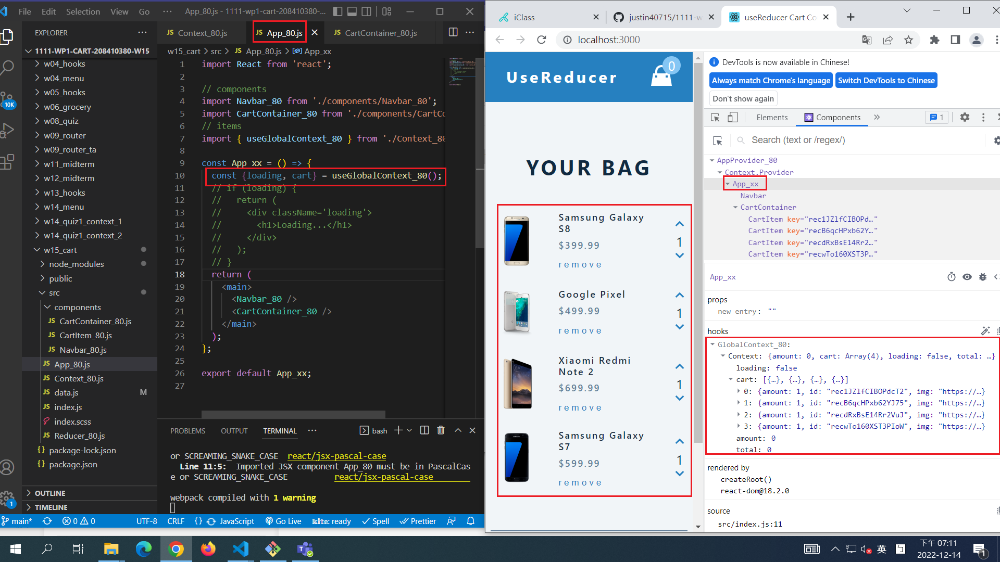
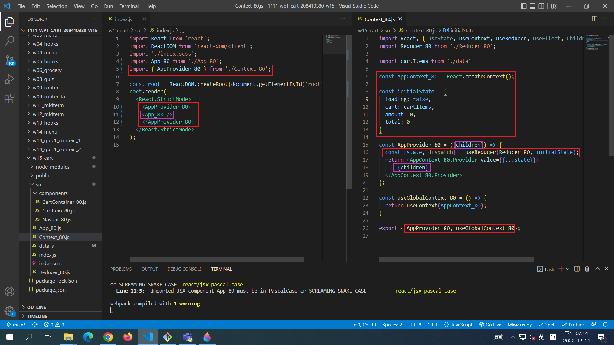
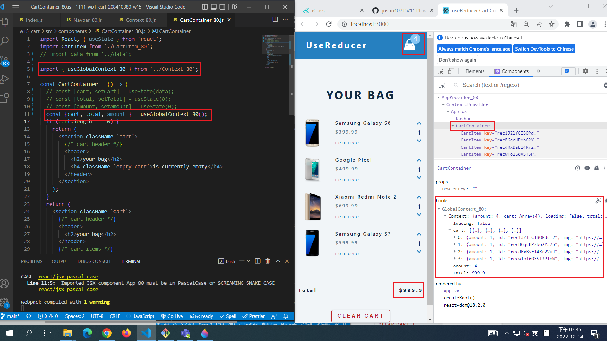
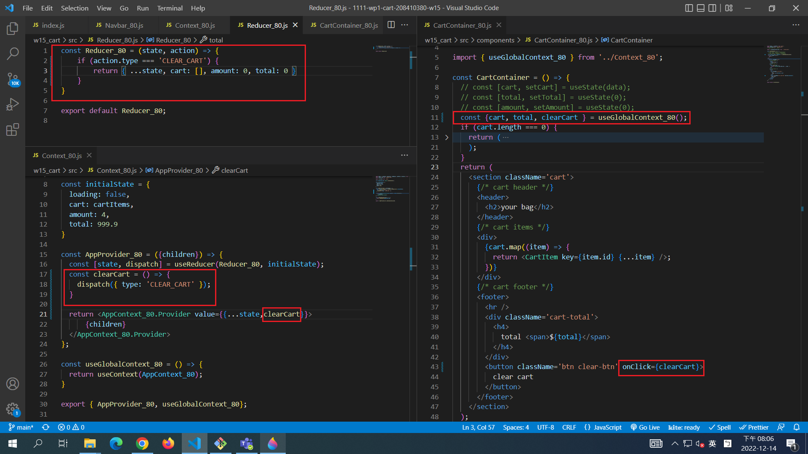
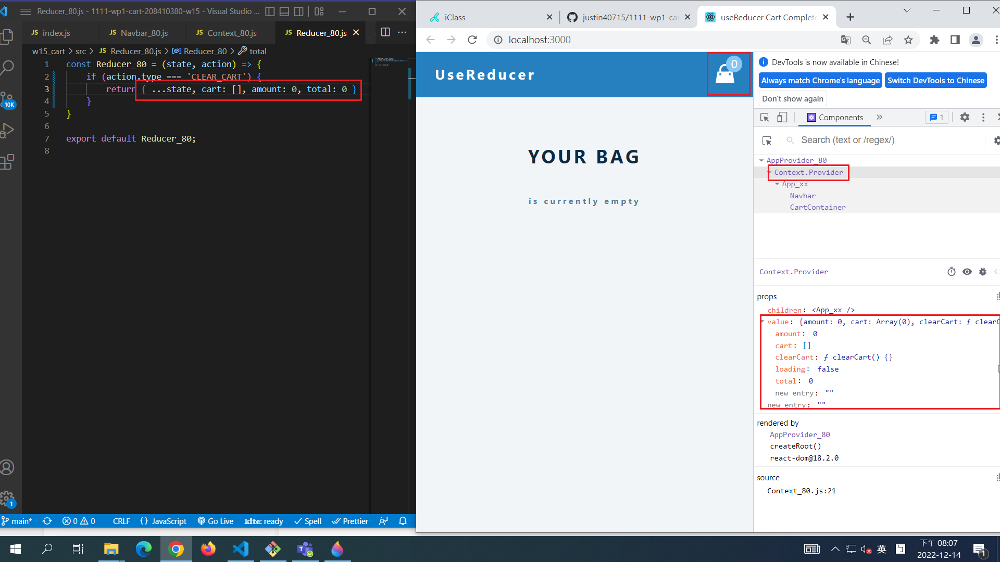

[Github URL] ()

### W15-P1: Setup AppProvider_80 for App_80 and get state data

### W15-P2: replace data in CartContainer using global context

### W15-P3: put clear cart function in global context

### w15-P4:

### w15-P5: show all logs

git log --pretty=format:"%h%x09%an%x09%ad%x09%s" --after="2022-12-13"